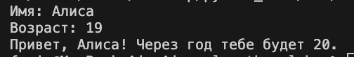
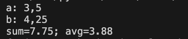
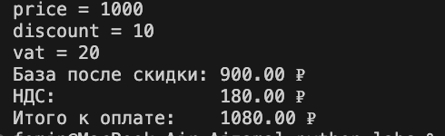
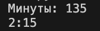
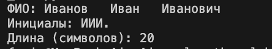

Кенешбаева Айжамал
БИВТ-26-6-1

## ЛР1 — Ввод/вывод и форматирование

### Задание 1
Входные данные: имя (строка), возраст (целое).
```
name = input("Имя: ")
age = int(input('Возраст: '))
print('Привет, ', name, '! ','Через год тебе будет ', age+1, '.', sep='')
```



### Задание 2
Входные данные: два числа (вещественные), допускаются точка или запятая.
```
a = float(input('a: ').replace(',', '.'))
b = float(input('b: ').replace(',', '.'))
avg = (a+b)/2
print('sum=', round(a+b, 2), '; ', 'avg=', round(avg, 2), sep='')
```



### Задание 3
Входные данные: price (₽), discount (%), vat (%) — вещественные.
```
price = float(input('price = ').replace(',','.'))
discount = float(input('discount = ').replace(',','.'))
vat = float(input('vat = ').replace(',','.'))

base = price * (1 - discount/100)
vat_amount = base * (vat/100)
total = base + vat_amount

print(f'База после скидки: {base:.2f} ₽')
print(f'НДС:               {vat_amount:.2f} ₽')
print(f'Итого к оплате:    {total:.2f} ₽')
```



### Задание 4
Входные данные: m — целые минуты.
```
m = int(input('Минуты: '))
print(f'{m//60}:{m%60:02d}')
```



### Задание 5
Входные данные: ФИО одной строкой (могут быть лишние пробелы).
```
name = input('ФИО: ').split()
print('Инициалы: ', name[0][0],name[1][0],name[2][0],'.', sep='')
print('Длина (символов):',len(name[0])+len(name[1])+len(name[2])+2)
```



